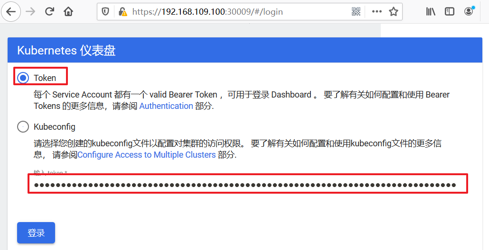

#### 部署Dashboard

- **下载yaml，并运行Dashboard**

```shell
# 下载yaml
[root@k8s-master01 ~]# wget https://raw.githubusercontent.com/kubernetes/dashboard/v2.6.0/aio/deploy/recommended.yaml 

# 如果是离线部署方式，我们需要先将kubernetes-dashboard所需要的容器分别倒入到主节点和工作节点的containerd或者docker中。

#修改recommended.yaml文件，修改如下内容:
image: docker.io/kubernetesui/dashboard:v2.6.0  #修改195行的容器名称，倒入之后可能发生变化
imagePullPolicy: IfNotPresent #修改容器拉去策略，默认是Always

# 修改kubernetes-dashboard的Service类型
kind: Service
apiVersion: v1
metadata:
  labels:
    k8s-app: kubernetes-dashboard
  name: kubernetes-dashboard
  namespace: kubernetes-dashboard
spec:
  type: NodePort  # 新增
  ports:
    - port: 443
      targetPort: 8443
      nodePort: 30009  # 新增
  selector:
    k8s-app: kubernetes-dashboard

# 部署
[root@k8s-master01 ~]# kubectl create -f recommended.yaml

# 查看namespace下的kubernetes-dashboard下的资源
[root@k8s-master01 ~]# kubectl get pod,svc -n kubernetes-dashboard
NAME                                             READY   STATUS    RESTARTS   AGE     IP            NODE                    NOMINATED NODE   READINESS GATES
pod/dashboard-metrics-scraper-6f669b9c9b-hfwkk   1/1     Running   0          9m20s   10.244.2.34   kube-node2.skills.com   <none>           <none>
pod/kubernetes-dashboard-9fbf74b88-7cnh8         1/1     Running   0          9m20s   10.244.1.65   kube-node1.skills.com   <none>           <none>

NAME                                TYPE        CLUSTER-IP       EXTERNAL-IP   PORT(S)         AGE     SELECTOR
service/dashboard-metrics-scraper   ClusterIP   10.104.183.202   <none>        8000/TCP        9m20s   k8s-app=dashboard-metrics-scraper
service/kubernetes-dashboard        NodePort    10.103.191.154   <none>        443:30009/TCP   9m20s   k8s-app=kubernetes-dashboard
```

- **创建访问账户，获取token**

```shell
# 创建账号
[root@k8s-master01-1 ~]# kubectl create serviceaccount dashboard-admin -n kubernetes-dashboard

# 授权
[root@k8s-master01-1 ~]# kubectl create clusterrolebinding dashboard-admin-rb --clusterrole=cluster-admin --serviceaccount=kubernetes-dashboard:dashboard-admin

# 获取账号token
[root@k8s-master01 ~]#  kubectl get secrets -n kubernetes-dashboard | grep dashboard-admin
dashboard-admin-token-xbqhh        kubernetes.io/service-account-token   3      2m35s

[root@k8s-master01 ~]# kubectl describe secrets dashboard-admin-token-xbqhh -n kubernetes-dashboard
Name:         dashboard-admin-token-xbqhh
Namespace:    kubernetes-dashboard
Labels:       <none>
Annotations:  kubernetes.io/service-account.name: dashboard-admin
              kubernetes.io/service-account.uid: 95d84d80-be7a-4d10-a2e0-68f90222d039

Type:  kubernetes.io/service-account-token

Data
====
namespace:  20 bytes
token:      eyJhbGciOiJSUzI1NiIsImtpZCI6ImJrYkF4bW5XcDhWcmNGUGJtek5NODFuSXl1aWptMmU2M3o4LTY5a2FKS2cifQ.eyJpc3MiOiJrdWJlcm5ldGVzL3NlcnZpY2VhY2NvdW50Iiwia3ViZXJuZXRlcy5pby9zZXJ2aWNlYWNjb3VudC9uYW1lc3BhY2UiOiJrdWJlcm5ldGVzLWRhc2hib2FyZCIsImt1YmVybmV0ZXMuaW8vc2VydmljZWFjY291bnQvc2VjcmV0Lm5hbWUiOiJkYXNoYm9hcmQtYWRtaW4tdG9rZW4teGJxaGgiLCJrdWJlcm5ldGVzLmlvL3NlcnZpY2VhY2NvdW50L3NlcnZpY2UtYWNjb3VudC5uYW1lIjoiZGFzaGJvYXJkLWFkbWluIiwia3ViZXJuZXRlcy5pby9zZXJ2aWNlYWNjb3VudC9zZXJ2aWNlLWFjY291bnQudWlkIjoiOTVkODRkODAtYmU3YS00ZDEwLWEyZTAtNjhmOTAyMjJkMDM5Iiwic3ViIjoic3lzdGVtOnNlcnZpY2VhY2NvdW50Omt1YmVybmV0ZXMtZGFzaGJvYXJkOmRhc2hib2FyZC1hZG1pbiJ9.NAl7e8ZfWWdDoPxkqzJzTB46sK9E8iuJYnUI9vnBaY3Jts7T1g1msjsBnbxzQSYgAG--cV0WYxjndzJY_UWCwaGPrQrt_GunxmOK9AUnzURqm55GR2RXIZtjsWVP2EBatsDgHRmuUbQvTFOvdJB4x3nXcYLN2opAaMqg3rnU2rr-A8zCrIuX_eca12wIp_QiuP3SF-tzpdLpsyRfegTJZl6YnSGyaVkC9id-cxZRb307qdCfXPfCHR_2rt5FVfxARgg_C0e3eFHaaYQO7CitxsnIoIXpOFNAR8aUrmopJyODQIPqBWUehb7FhlU1DCduHnIIXVC_UICZ-MKYewBDLw
ca.crt:     1025 bytes
```

- **通过浏览器访问Dashboard的UI**

- 在登录页面上输入上面的token



- 出现下面的页面代表成功


#### 使用DashBoard

- 本章节以Deployment为例演示DashBoard的使用

- **查看**

- 选择指定的命名空间`dev`，然后点击`Deployments`，查看dev空间下的所有deployment


- **扩缩容**

- 在`Deployment`上点击`规模`，然后指定`目标副本数量`，点击确定


- **编辑**

- 在`Deployment`上点击`编辑`，然后修改`yaml文件`，点击确定


- **查看Pod**

- 点击`Pods`, 查看pods列表


- **操作Pod**

- 选中某个Pod，可以对其执行日志（logs）、进入执行（exec）、编辑、删除操作


> Dashboard提供了kubectl的绝大部分功能，这里不再一一演示
