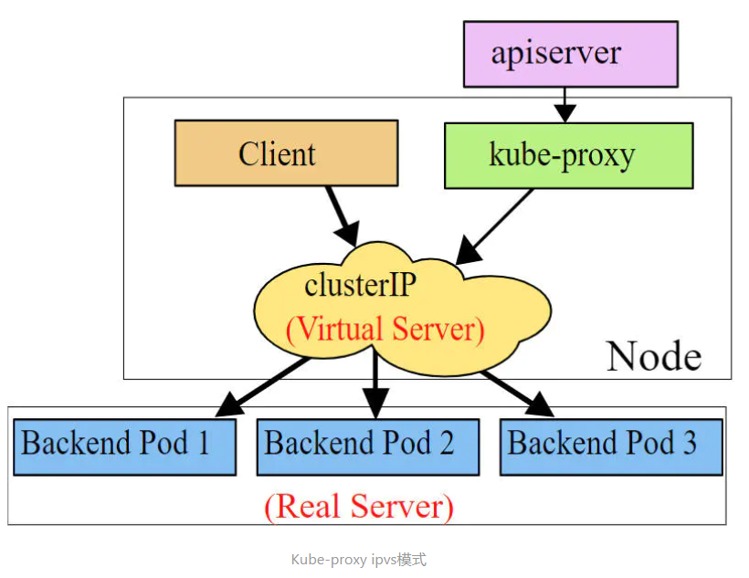

## Service详解

#### Service介绍

- 在kubernetes中，pod是应用程序的载体，我们可以通过pod的ip来访问应用程序，但是pod的ip地址不是固定的，这也就意味着不方便直接采用pod的ip对服务进行访问。

- 为了解决这个问题，kubernetes提供了Service资源，Service会对提供同一个服务的多个pod进行聚合，并且提供一个统一的入口地址。通过访问Service的入口地址就能访问到后面的pod服务。


- Service在很多情况下只是一个概念，真正起作用的其实是kube-proxy服务进程，每个Node节点上都运行着一个kube-proxy服务进程。当创建Service的时候会通过api-server向etcd写入创建的service的信息，而kube-proxy会基于监听的机制发现这种Service的变动，然后**它会将最新的Service信息转换成对应的访问规则**。


```shell
# 10.97.97.97:80 是service提供的访问入口
# 当访问这个入口的时候，可以发现后面有三个pod的服务在等待调用，
# kube-proxy会基于rr（轮询）的策略，将请求分发到其中一个pod上去
# 这个规则会同时在集群内的所有节点上都生成，所以在任何一个节点上访问都可以。
[root@node1 ~]# ipvsadm -Ln
IP Virtual Server version 1.2.1 (size=4096)
Prot LocalAddress:Port Scheduler Flags
  -> RemoteAddress:Port           Forward Weight ActiveConn InActConn
TCP  10.97.97.97:80 rr
  -> 10.244.1.39:80               Masq    1      0          0
  -> 10.244.1.40:80               Masq    1      0          0
  -> 10.244.2.33:80               Masq    1      0          0
```

- **kube-proxy目前支持三种工作模式:**
 - userspace 模式
 - userspace模式下，kube-proxy会为每一个Service创建一个监听端口，发向Cluster IP的请求被Iptables规则重定向到kube-proxy监听的端口上，kube-proxy根据LB算法选择一个提供服务的Pod并和其建立链接，以将请求转发到Pod上。  该模式下，kube-proxy充当了一个四层负责均衡器的角色。由于kube-proxy运行在userspace中，在进行转发处理时会增加内核和用户空间之间的数据拷贝，虽然比较稳定，但是效率比较低。


- **iptables 模式**
 - iptables模式下，kube-proxy为service后端的每个Pod创建对应的iptables规则，直接将发向Cluster IP的请求重定向到一个Pod IP。  该模式下kube-proxy不承担四层负责均衡器的角色，只负责创建iptables规则。该模式的优点是较userspace模式效率更高，但不能提供灵活的LB策略，当后端Pod不可用时也无法进行重试。


- ipvs 模式
 - ipvs模式和iptables类似，kube-proxy监控Pod的变化并创建相应的ipvs规则。ipvs相对iptables转发效率更高。除此以外，ipvs支持更多的LB算法。



```shell
# 此模式必须安装ipvs内核模块，否则会降级为iptables
# 开启ipvs
[root@k8s-master01 ~]# kubectl edit cm kube-proxy -n kube-system
# 修改mode: "ipvs"
[root@k8s-master01 ~]# kubectl delete pod -l k8s-app=kube-proxy -n kube-system
[root@node1 ~]# ipvsadm -Ln
IP Virtual Server version 1.2.1 (size=4096)
Prot LocalAddress:Port Scheduler Flags
  -> RemoteAddress:Port           Forward Weight ActiveConn InActConn
TCP  10.97.97.97:80 rr
  -> 10.244.1.39:80               Masq    1      0          0
  -> 10.244.1.40:80               Masq    1      0          0
  -> 10.244.2.33:80               Masq    1      0          0
```

#### Service类型
- Service的资源清单文件：

```yaml
apiVersion: v1  # 资源版本
kind: Service  # 资源类型
metadata: # 元数据
  name: service # 资源名称
  namespace: dev # 命名空间
spec: # 描述
  selector: # 标签选择器，用于确定当前service代理哪些pod
    app: nginx
  type: # Service类型，指定service的访问方式
  clusterIP:  # 虚拟服务的ip地址
  sessionAffinity: # session亲和性，支持ClientIP、None两个选项
  ports: # 端口信息
    - protocol: TCP 
      port: 3017  # service端口
      targetPort: 5003 # pod端口
      nodePort: 31122 # 主机端口
```
- ClusterIP：默认值，它是Kubernetes系统自动分配的虚拟IP，只能在集群内部访问
- NodePort：将Service通过指定的Node上的端口暴露给外部，通过此方法，就可以在集群外部访问服务
- LoadBalancer：使用外接负载均衡器完成到服务的负载分发，注意此模式需要外部云环境支持
- ExternalName： 把集群外部的服务引入集群内部，直接使用

#### Service使用
  -  实验环境准备
  - 在使用service之前，首先利用Deployment创建出3个pod，注意要为pod设置`app=nginx-pod`的标签
  - 创建deployment.yaml，内容如下：

```yaml
apiVersion: apps/v1
kind: Deployment      
metadata:
  name: pc-deployment
  namespace: dev
spec: 
  replicas: 3
  selector:
    matchLabels:
      app: nginx-pod
  template:
    metadata:
      labels:
        app: nginx-pod
    spec:
      containers:
      - name: nginx
        image: nginx:1.17.1
        ports:
        - containerPort: 80
```

```shell
[root@k8s-master01 ~]# kubectl create -f deployment.yaml
deployment.apps/pc-deployment created

# 查看pod详情
[root@k8s-master01 ~]# kubectl get pods -n dev -o wide --show-labels
NAME                             READY   STATUS     IP            NODE     LABELS
pc-deployment-66cb59b984-8p84h   1/1     Running    10.244.1.39   node1    app=nginx-pod
pc-deployment-66cb59b984-vx8vx   1/1     Running    10.244.2.33   node2    app=nginx-pod
pc-deployment-66cb59b984-wnncx   1/1     Running    10.244.1.40   node1    app=nginx-pod

# 为了方便后面的测试，修改下三台nginx的index.html页面（三台修改的IP地址不一致）
# kubectl exec -it pc-deployment-66cb59b984-8p84h -n dev /bin/sh
# echo "10.244.1.39" > /usr/share/nginx/html/index.html

#修改完毕之后，访问测试
[root@k8s-master01 ~]# curl 10.244.1.39
10.244.1.39
[root@k8s-master01 ~]# curl 10.244.2.33
10.244.2.33
[root@k8s-master01 ~]# curl 10.244.1.40
10.244.1.40
```

- **ClusterIP类型的Service**
  - 创建service-clusterip.yaml文件

```yaml
apiVersion: v1
kind: Service
metadata:
  name: service-clusterip
  namespace: dev
spec:
  selector:
    app: nginx-pod
  clusterIP: 10.97.97.97 # service的ip地址，如果不写，默认会生成一个
  type: ClusterIP
  ports:
  - port: 80  # Service端口       
    targetPort: 80 # pod端口
```

```shell
# 创建service
[root@k8s-master01 ~]# kubectl create -f service-clusterip.yaml
service/service-clusterip created

# 查看service
[root@k8s-master01 ~]# kubectl get svc -n dev -o wide
NAME                TYPE        CLUSTER-IP    EXTERNAL-IP   PORT(S)   AGE   SELECTOR
service-clusterip   ClusterIP   10.97.97.97   <none>        80/TCP    13s   app=nginx-pod

# 查看service的详细信息
# 在这里有一个Endpoints列表，里面就是当前service可以负载到的服务入口
[root@k8s-master01 ~]# kubectl describe svc service-clusterip -n dev
Name:              service-clusterip
Namespace:         dev
Labels:            <none>
Annotations:       <none>
Selector:          app=nginx-pod
Type:              ClusterIP
IP:                10.97.97.97
Port:              <unset>  80/TCP
TargetPort:        80/TCP
Endpoints:         10.244.1.39:80,10.244.1.40:80,10.244.2.33:80
Session Affinity:  None
Events:            <none>

# 查看ipvs的映射规则
[root@k8s-master01 ~]# ipvsadm -Ln
TCP  10.97.97.97:80 rr
  -> 10.244.1.39:80               Masq    1      0          0
  -> 10.244.1.40:80               Masq    1      0          0
  -> 10.244.2.33:80               Masq    1      0          0

# 访问10.97.97.97:80观察效果
[root@k8s-master01 ~]# curl 10.97.97.97:80
10.244.2.33
```

- **Endpoint**
  - Endpoint是kubernetes中的一个资源对象，存储在etcd中，用来记录一个service对应的所有pod的访问地址，它是根据service配置文件中selector描述产生的。
  - 一个Service由一组Pod组成，这些Pod通过Endpoints暴露出来，**Endpoints是实现服务的端点集合**。换句话说，service和pod之间的联系是通过endpoints实现的。


- **负载分发策略**
  - 对Service的访问被分发到了后端的Pod上去，目前kubernetes提供了两种负载分发策略：
    - 如果不定义，默认使用kube-proxy的策略，比如随机、轮询
    - 基于客户端地址的会话保持模式，即来自同一个客户端发起的所有请求都会转发到固定的一个Pod上

- 此模式可以使在spec中添加`sessionAffinity:ClientIP`选项

```shell
# 查看ipvs的映射规则【rr 轮询】
[root@k8s-master01 ~]# ipvsadm -Ln
TCP  10.97.97.97:80 rr
  -> 10.244.1.39:80               Masq    1      0          0
  -> 10.244.1.40:80               Masq    1      0          0
  -> 10.244.2.33:80               Masq    1      0          0

# 循环访问测试
[root@k8s-master01 ~]# while true;do curl 10.97.97.97:80; sleep 5; done;
10.244.1.40
10.244.1.39
10.244.2.33
10.244.1.40
10.244.1.39
10.244.2.33

# 修改分发策略----sessionAffinity:ClientIP

# 查看ipvs规则【persistent 代表持久】
[root@k8s-master01 ~]# ipvsadm -Ln
TCP  10.97.97.97:80 rr persistent 10800
  -> 10.244.1.39:80               Masq    1      0          0
  -> 10.244.1.40:80               Masq    1      0          0
  -> 10.244.2.33:80               Masq    1      0          0

# 循环访问测试
[root@k8s-master01 ~]# while true;do curl 10.97.97.97; sleep 5; done;
10.244.2.33
10.244.2.33
10.244.2.33
  
# 删除service
[root@k8s-master01 ~]# kubectl delete -f service-clusterip.yaml
service "service-clusterip" deleted
```

- **HeadLiness类型的Service**

- 在某些场景中，开发人员可能不想使用Service提供的负载均衡功能，而希望自己来控制负载均衡策略，针对这种情况，kubernetes提供了HeadLiness Service，这类Service不会分配Cluster IP，如果想要访问service，只能通过service的域名进行查询。

- 创建service-headliness.yaml

```yaml
apiVersion: v1
kind: Service
metadata:
  name: service-headliness
  namespace: dev
spec:
  selector:
    app: nginx-pod
  clusterIP: None # 将clusterIP设置为None，即可创建headliness Service
  type: ClusterIP
  ports:
  - port: 80    
    targetPort: 80
```

```shell
# 创建service
[root@k8s-master01 ~]# kubectl create -f service-headliness.yaml
service/service-headliness created

# 获取service， 发现CLUSTER-IP未分配
[root@k8s-master01 ~]# kubectl get svc service-headliness -n dev -o wide
NAME                 TYPE        CLUSTER-IP   EXTERNAL-IP   PORT(S)   AGE   SELECTOR
service-headliness   ClusterIP   None         <none>        80/TCP    11s   app=nginx-pod

# 查看service详情
[root@k8s-master01 ~]# kubectl describe svc service-headliness  -n dev
Name:              service-headliness
Namespace:         dev
Labels:            <none>
Annotations:       <none>
Selector:          app=nginx-pod
Type:              ClusterIP
IP:                None
Port:              <unset>  80/TCP
TargetPort:        80/TCP
Endpoints:         10.244.1.39:80,10.244.1.40:80,10.244.2.33:80
Session Affinity:  None
Events:            <none>

# 查看域名的解析情况
[root@k8s-master01 ~]# kubectl exec -it pc-deployment-66cb59b984-8p84h -n dev /bin/sh
/ # cat /etc/resolv.conf
nameserver 10.96.0.10
search dev.svc.cluster.local svc.cluster.local cluster.local

[root@k8s-master01 ~]# dig @10.96.0.10 service-headliness.dev.svc.cluster.local
service-headliness.dev.svc.cluster.local. 30 IN A 10.244.1.40
service-headliness.dev.svc.cluster.local. 30 IN A 10.244.1.39
service-headliness.dev.svc.cluster.local. 30 IN A 10.244.2.33
```

- **NodePort类型的Service**
  - 在之前的样例中，创建的Service的ip地址只有集群内部才可以访问，如果希望将Service暴露给集群外部使用，那么就要使用到另外一种类型的Service，称为NodePort类型。NodePort的工作原理其实就是**将service的端口映射到Node的一个端口上**，然后就可以通过`NodeIp:NodePort`来访问service了。


- 创建service-nodeport.yaml

```yaml
apiVersion: v1
kind: Service
metadata:
  name: service-nodeport
  namespace: dev
spec:
  selector:
    app: nginx-pod
  type: NodePort # service类型
  ports:
  - port: 80
    nodePort: 30002 # 指定绑定的node的端口(默认的取值范围是：30000-32767), 如果不指定，会默认分配
    targetPort: 80
```

```shell
# 创建service
[root@k8s-master01 ~]# kubectl create -f service-nodeport.yaml
service/service-nodeport created

# 查看service
[root@k8s-master01 ~]# kubectl get svc -n dev -o wide
NAME               TYPE       CLUSTER-IP      EXTERNAL-IP   PORT(S)       SELECTOR
service-nodeport   NodePort   10.105.64.191   <none>        80:30002/TCP  app=nginx-pod

# 接下来可以通过电脑主机的浏览器去访问集群中任意一个nodeip的30002端口，即可访问到pod
```

- **LoadBalancer类型的Service**
  - LoadBalancer和NodePort很相似，目的都是向外部暴露一个端口，区别在于LoadBalancer会在集群的外部再来做一个负载均衡设备，而这个设备需要外部环境支持的，外部服务发送到这个设备上的请求，会被设备负载之后转发到集群中。


- **ExternalName类型的Service**
  - ExternalName类型的Service用于引入集群外部的服务，它通过`externalName`属性指定外部一个服务的地址，然后在集群内部访问此service就可以访问到外部的服务了。


```shell
apiVersion: v1
kind: Service
metadata:
  name: service-externalname
  namespace: dev
spec:
  type: ExternalName # service类型
  externalName: www.baidu.com  #改成ip地址也可以
```

```shell
# 创建service
[root@k8s-master01 ~]# kubectl  create -f service-externalname.yaml
service/service-externalname created

# 域名解析
[root@k8s-master01 ~]# dig @10.96.0.10 service-externalname.dev.svc.cluster.local
service-externalname.dev.svc.cluster.local. 30 IN CNAME www.baidu.com.
www.baidu.com.          30      IN      CNAME   www.a.shifen.com.
www.a.shifen.com.       30      IN      A       39.156.66.18
www.a.shifen.com.       30      IN      A       39.156.66.14
```

- **Ingress介绍**

- 在前面课程中已经提到，Service对集群之外暴露服务的主要方式有两种：NotePort和LoadBalancer，但是这两种方式，都有一定的缺点：
  - NodePort方式的缺点是会占用很多集群机器的端口，那么当集群服务变多的时候，这个缺点就愈发明显
  - LB方式的缺点是每个service需要一个LB，浪费、麻烦，并且需要kubernetes之外设备的支持

- 基于这种现状，kubernetes提供了Ingress资源对象，Ingress只需要一个NodePort或者一个LB就可以满足暴露多个Service的需求。工作机制大致如下图表示：


- 实际上，Ingress相当于一个7层的负载均衡器，是kubernetes对反向代理的一个抽象，它的工作原理类似于Nginx，可以理解成在**Ingress里建立诸多映射规则，Ingress Controller通过监听这些配置规则并转化成Nginx的反向代理配置 , 然后对外部提供服务**。在这里有两个核心概念：
  - ingress：kubernetes中的一个对象，作用是定义请求如何转发到service的规则
  - ingress controller：具体实现反向代理及负载均衡的程序，对ingress定义的规则进行解析，根据配置的规则来实现请求转发，实现方式有很多，比如Nginx, Contour, Haproxy等等

- Ingress（以Nginx为例）的工作原理如下：

  - 用户编写Ingress规则，说明哪个域名对应kubernetes集群中的哪个Service
  - Ingress控制器动态感知Ingress服务规则的变化，然后生成一段对应的Nginx反向代理配置
  - Ingress控制器会将生成的Nginx配置写入到一个运行着的Nginx服务中，并动态更新
  - 到此为止，其实真正在工作的就是一个Nginx了，内部配置了用户定义的请求转发规则


- **Ingress使用**
- 环境准备 搭建ingress环境

```shell
# 创建文件夹
[root@k8s-master01 ~]# mkdir ingress-controller
[root@k8s-master01 ~]# cd ingress-controller/

# 获取ingress-nginx，本次案例使用的是1.2.1版本
[root@k8s-master01 ingress-controller]# wget https://raw.githubusercontent.com/kubernetes/ingress-nginx/main/deploy/static/provider/cloud/1.23/deploy.yaml

# 修改deploy.yaml文件:
# 将416行的 image:registry.k8s.io/ingress-nginx/controller:v1.2.1@sha256:5516d103a9c2ecc4f026efbd4b40662ce22dc1f824fb129ed121460aaa5c47f8 修改为 image:registry.k8s.io/ingress-nginx/controller:v1.2.1
# 将513行和526行的 image:registry.k8s.io/ingress-nginx/kube-webhook-certgen:v1.1.1@sha256:64d8c73dca984af206adf9d6d7e46aa550362b1d7a01f3a0a91b20cc67868660 修改为 image:registry.k8s.io/ingress-nginx/kube-webhook-certgen:v1.1.1
# 添加或修改396行参数为:
- args:
        - /nginx-ingress-controller
        - --election-id=ingress-controller-leader
        - --controller-class=k8s.io/ingress-nginx
        - --ingress-class=nginx
        - --configmap=$(POD_NAMESPACE)/ingress-nginx-controller
        - --validating-webhook=:8443
        - --validating-webhook-certificate=/usr/local/certificates/cert
        - --validating-webhook-key=/usr/local/certificates/key
        - --watch-ingress-without-class=true
        - --publish-status-address=localhost   #用于指定ingress向外映射的地址

# 创建ingress-nginx
[root@k8s-master01 ingress-controller]# kubectl create -f deploy.yaml

# 查看ingress-nginx
[root@k8s-master01 ingress-controller]# kubectl get pod -n ingress-nginx
[root@kube-master ~]# kubectl get pods -n ingress-nginx
NAME                                       READY   STATUS      RESTARTS   AGE
ingress-nginx-admission-create-nth6m       0/1     Completed   0          3h4m
ingress-nginx-admission-patch-mkmk5        0/1     Completed   1          3h4m
ingress-nginx-controller-76c8545f9-27lnv   1/1     Running     0          3h4m


# 查看service
[root@k8s-master01 ingress-controller]# kubectl get svc -n ingress-nginx
NAME                                 TYPE           CLUSTER-IP       EXTERNAL-IP   PORT(S)                      AGE
ingress-nginx-controller             LoadBalancer   10.98.228.163    <pending>     80:31004/TCP,443:30786/TCP   3h5m
ingress-nginx-controller-admission   ClusterIP      10.100.125.193   <none>        443/TCP                      3h5m
```

- 准备service和pod

为了后面的实验比较方便，创建如下图所示的模型


创建tomcat-nginx.yaml

```yaml
apiVersion: apps/v1
kind: Deployment
metadata:
  name: nginx-deployment
  namespace: dev
spec:
  replicas: 3
  selector:
    matchLabels:
      app: nginx-pod
  template:
    metadata:
      labels:
        app: nginx-pod
    spec:
      containers:
      - name: nginx
        image: nginx:1.17.1
        ports:
        - containerPort: 80

---

apiVersion: apps/v1
kind: Deployment
metadata:
  name: tomcat-deployment
  namespace: dev
spec:
  replicas: 3
  selector:
    matchLabels:
      app: tomcat-pod
  template:
    metadata:
      labels:
        app: tomcat-pod
    spec:
      containers:
      - name: tomcat
        image: tomcat:8.5-jre10-slim
        ports:
        - containerPort: 8080

---

apiVersion: v1
kind: Service
metadata:
  name: nginx-service
  namespace: dev
spec:
  selector:
    app: nginx-pod
  type: NodePort 
  ports:
  - port: 80
    targetPort: 80

---

apiVersion: v1
kind: Service
metadata:
  name: tomcat-service
  namespace: dev
spec:
  selector:
    app: tomcat-pod
  type: NodePort
  ports:
  - port: 8080
    targetPort: 8080
```

```shell
# 创建
[root@k8s-master01 ~]# kubectl create -f tomcat-nginx.yaml

# 查看
[root@k8s-master01 ~]# kubectl get svc -n dev
NAME             TYPE        CLUSTER-IP   EXTERNAL-IP   PORT(S)    AGE
nginx-service    ClusterIP   None         <none>        80/TCP     48s
tomcat-service   ClusterIP   None         <none>        8080/TCP   48s
```

- Http代理

创建ingress-http.yaml

```yaml
apiVersion: networking.k8s.io/v1
kind: Ingress
metadata:
  name: ingress-http
  namespace: dev
spec:
 rules:
  - host: nginx.skills.com
    http:
     paths:
     - pathType: Prefix
       path: /
       backend:
        service:
         name: service-1
         port:
          number: 80
  - host: tomcat.skills.com
    http:
     paths:
     - pathType: Prefix
       path: /
       backend:
        service:
         name: service-2
         port:
          number: 8080
```

```shell
# 创建
[root@k8s-master01 ~]# kubectl create -f ingress-http.yaml
ingress.extensions/ingress-http created

# 查看
[root@k8s-master01 ~]# kubectl get ingress -n dev
NAME           CLASS    HOSTS                                ADDRESS     PORTS   AGE
ingress-http   <none>   nginx.skills.com,tomcat.skills.com   localhost   80      10m


# 查看详情
[root@k8s-master01 ~]# kubectl describe ingress ingress-http  -n dev
Name:             ingress-http
Labels:           <none>
Namespace:        dev
Address:          localhost
Default backend:  default-http-backend:80 (<error: endpoints "default-http-backend" not found>)
Rules:
  Host               Path  Backends
  ----               ----  --------
  nginx.skills.com
                     /   service-1:80 (10.244.1.10:80,10.244.1.9:80,10.244.2.10:80 + 2 more...)
  tomcat.skills.com
                     /   service-2:8080 (10.244.1.19:8080,10.244.1.20:8080,10.244.2.18:8080 + 2 more...)
Annotations:         <none>
Events:
  Type    Reason  Age                From                      Message
  ----    ------  ----               ----                      -------
  Normal  Sync    10m (x2 over 11m)  nginx-ingress-controller  Scheduled for sync
```
- 验证测试:
  - 在DNS上服务器上配置nginx.skills.com和tomcat.skills.com的解析，分别指向主节点的ip地址(我的环境汇总主控节点的ip地址为192.168.107.162)
  - 使用如下命令查看ingress端口:
```
  [root@k8s-master01 ~]# kubectl get svc -n ingress-nginxNAME                                 TYPE           CLUSTER-IP     EXTERNAL-IP   PORT(S)                      AGE
  ingress-nginx-controller             LoadBalancer   10.98.80.75    <pending>     80:30508/TCP,443:31451/TCP   34m
  ingress-nginx-controller-admission   ClusterIP      10.97.35.244   <none>        443/TCP                      34m
  #其中 30508/TCP,443:31451/TCP ,30508为ingress的映射端口,分别对应http协议的nginx集群的80口和tomcat集群的8080口
```
  - 使用`curl nginx.skills.com:30508`可以访问到nginx的服务器集群
  - 使用`curl tomcat.skills.com:30508`可以访问到tomcat的服务器集群


<br>
<br>

- Https代理
- 创建证书

- 在master节点上生成证书
`openssl req -x509 -sha256 -nodes -days 365 -newkey rsa:2048 -keyout tls.key -out tls.crt -subj "/C=CN/ST=BJ/L=BJ/O=nginx/CN=itheima.com"`

- 将生成好的公钥和私钥放入kubernetes密钥，密钥名称为 tls-secret
- 使用命令行方式创建:
`kubectl create secret tls tls-secret --key tls.key --cert tls.crt`

- 使用yaml文件方式创建:

```yaml
apiVersion: v1
kind: Secret
metadata:
  name: tls-secret 
  namespace: default
data:
  tls.crt: base64 encoded cert
  tls.key: base64 encoded key
type: kubernetes.io/t
```

<br>

- 创建ingress-https.yaml
 
```yaml
apiVersion: networking.k8s.io/v1
kind: Ingress
metadata:
  name: ingress-https
  namespace: dev
spec:
  tls:
   - hosts:
     - nginx.skills.com
     - tomcat.skills.com
     secretName: tls-secret
  rules:
  - host: nginx.skills.com
    http:
     paths:
      - path: /
        pathType: Prefix
        backend:
          service:
           name: service-1
           port:
            number: 80
  - host: tomcat.skills.com
    http:
     paths:
      - path: /
        pathType: Prefix
        backend:
         service:
          name: service-2
          port:
           number: 8080
```

```shell
# 创建
[root@k8s-master01 ~]# kubectl create -f ingress-https.yaml
ingress.extensions/ingress-https created

# 查看
[root@k8s-master01 ~]# kubectl get ingress ingress-https -n dev
NAME            HOSTS                                  ADDRESS         PORTS     AGE
NAME            CLASS    HOSTS                                ADDRESS     PORTS     AGE
ingress-https   <none>   nginx.skills.com,tomcat.skills.com   localhost   80, 443   37m

# 查看详情
[root@k8s-master01 ~]# kubectl describe ingress ingress-https -n dev
Name:             ingress-https
Labels:           <none>
Namespace:        hdev
Address:          localhost
Default backend:  default-http-backend:80 (<error: endpoints "default-http-backend" not found>)
TLS:
  tls-secret terminates nginx.skills.com,tomcat.skills.com
Rules:
  Host               Path  Backends
  ----               ----  --------
  nginx.skills.com
                     /   service-1:80 (10.244.1.10:80,10.244.1.9:80,10.244.2.10:80 + 2 more...)
  tomcat.skills.com
                     /   service-2:8080 (10.244.1.19:8080,10.244.1.20:8080,10.244.2.18:8080 + 2 more...)
Annotations:         <none>
Events:
  Type    Reason  Age                From                      Message
  ----    ------  ----               ----                      -------
  Normal  Sync    38m (x2 over 38m)  nginx-ingress-controller  Scheduled for sync

#查看ingress映射的443端口
[root@k8s-master01 ~]# kubectl get svc -n ingress-nginx
NAME                                 TYPE           CLUSTER-IP     EXTERNAL-IP   PORT(S)                      AGE
ingress-nginx-controller             LoadBalancer   10.98.80.75    <pending>     80:30508/TCP,443:31451/TCP   14h
ingress-nginx-controller-admission   ClusterIP      10.97.35.244   <none>        443/TCP                      14h
#这里443端口映射的接口号为31451
```
  - 使用`curl -k https://nginx.skills.com:31451`可以访问到nginx的服务器集群
  - 使用`curl -k http://tomcat.skills.com:31451`可以访问到tomcat的服务器集群

