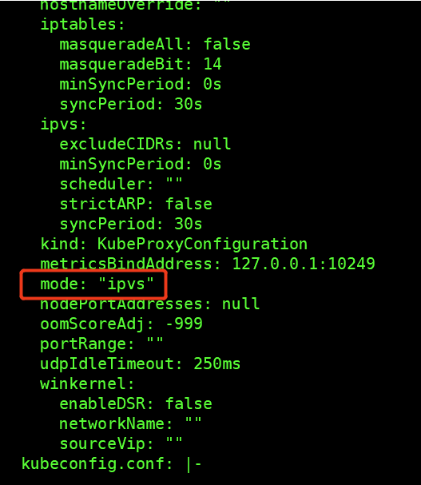
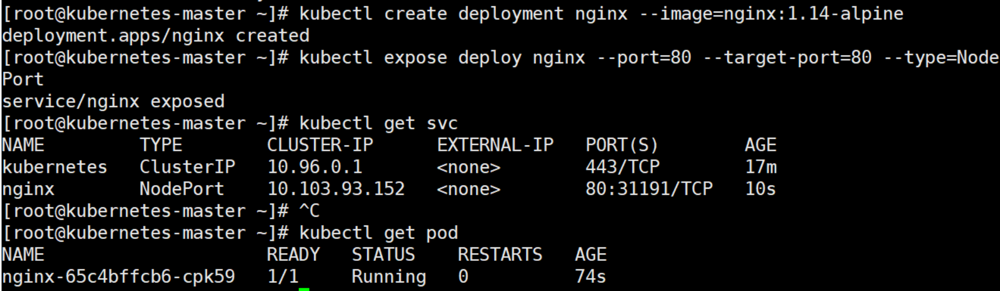

#### 1.环境初始化
- 在配置环境时，一定要配置网关-否则可能造成网络插件无法启用
##### 1.1 检查操作系统的版本
- 本次安装kubernetes集群使用的版本是Rocky Linux release 8.5

```shell
[root@kube-master ~]# cat /etc/redhat-release
Rocky Linux release 8.5 (Green Obsidian)
```

##### 1.2 主机名解析
- 为了方便集群节点间的直接调用，在这个配置一下主机名解析，企业中推荐使用内部DNS服务器
 - 这里可以编辑/etc/hosts文件，添加以下内容

```shell
192.168.107.162 kube-master.skills.com
192.168.107.163 kube-node1.skills.com
192.168.107.164 kube-node2.skills.com
```

##### 1.3 时间同步

- kubernetes要求集群中的节点时间必须精确一直，这里使用chronyd服务从网络同步时间,企业中建议配置内部的会见同步服务器

```shell
[root@kube-master ~]# systemctl start chronyd
[root@kube-master ~]# systemctl enable chronyd
```

##### 1.4  禁用iptable和firewalld服务

- kubernetes和docker 在运行的中会产生大量的iptables规则，为了不让系统规则跟它们混淆，直接关闭系统的规则
 - 关闭防火墙

```shell
[root@kube-master ~]# systemctl stop firewalld
[root@kube-master ~]# systemctl disable firewalld
```
 - 关闭ntfables或者iptables

   - ntftables:

```shell
[root@kube-master ~]# systemctl stop nftables
[root@kube-master ~]# systemctl disable nftables
```
   - iptables:

```shell
[root@kube-master ~]# systemctl stop iptables
[root@kube-master ~]# systemctl disable iptables
```

##### 1.5 禁用selinux
- selinux是linux系统下的一个安全服务，如果不关闭它，在安装集群中会产生各种各样的奇葩问题
  - 编辑/etc/selinux/config 文件，修改SELINUX的值为disable
  - 注意修改完毕之后需要重启linux服务
 
 ```shell
 SELINUX=disabled
 ```

##### 1.6 禁用swap分区
-  swap分区指的是虚拟内存分区，它的作用是物理内存使用完，之后将磁盘空间虚拟成内存来使用，启用swap设备会对系统的性能产生非常负面的影响，因此kubernetes要求每个节点都要禁用swap设备，但是如果因为某些原因确实不能关闭swap分区，就需要在集群安装过程中通过明确的参数进行配置说明
  - 编辑分区配置文件/etc/fstab，注释掉swap分区一行,注意修改完毕之后需要重启linux服务

    - 编辑/etc/fstab

```shell
注释掉 /dev/mapper/centos-swap swap
# /dev/mapper/centos-swap swap
```
    - 临时关闭swap分区

```shell
[root@kube-master ~]# swapoff -a
```
    - 查看swap分区是否关闭,使用命令free

```shell
[root@kube-master]# free
              total        used        free      shared  buff/cache   available
              Mem:        3825584      179508     3422976        8760      223100     3417568
```
- 为什么需要关闭Swap分区
  - 性能：Kubernetes是一个高度依赖内存的分布式系统，它要求节点上的容器和组件具有良好的内存性能。当系统的内存不足时，Linux会使用Swap分区作为虚拟内存来临时存储不活跃的内存页。然而，Swap分区的性能远远不及物理内存，使用Swap可能导致应用程序和容器性能下降。
  - 不可预测的行为：当系统开始使用Swap分区时，由于Swap速度较慢，可能会导致容器和应用程序的响应时间增加，甚至可能导致容器无法启动或执行异常。这会导致不可预测的行为，影响Kubernetes集群的稳定性和可靠性。
  - OOM（Out of Memory）管理：在Kubernetes中，内存资源不足时，Kubernetes通过OOM Killer来终止占用大量内存的进程，以保护系统免受内存耗尽的影响。但是，当Swap分区启用时，OOM Killer可能会表现出不可预测的行为，导致不恰当的进程被终止。
  - 容器限制：Kubernetes中的容器资源限制通常只限制内存和CPU资源，而不包括Swap分区。因此，如果Swap分区开启，容器可能会继续使用Swap，而不受资源限制的约束，这可能会导致资源分配不均衡。
  - 因此，为了保证Kubernetes集群的性能、稳定性和可靠性，关闭Swap分区通常是推荐的做法。

##### 1.7 修改linux的内核参数

- 创建containerd.conf文件并添加一下内容:

```shell
cat > /etc/modules-load.d/containerd.conf <<EOF
overlay
br_netfilter
EOF
```
  - 加载网桥过滤模块:

```shell
[root@kube-master ~]# modprobe overlay

#modprobe overlay命令用于加载Linux内核中的"overlay"模块。在容器技术中，overlay是一种联合文件系统（UnionFS），它允许将多个文件系统以层叠的方式合并在一起，创建一个统一的文件系统视图。
#在Docker和其他容器化平台中，overlay文件系统被广泛用于实现镜像层叠和容器的文件系统隔离。当你运行Docker容器时，每个容器都有自己的文件系统，该文件系统是由底层镜像和一系列读写层组成的。overlay技术使得这些层能够被有效地组合在一起，提供了轻量、高效的容器文件系统。
#通过运行modprobe overlay命令，Linux内核加载overlay模块，使得容器运行时能够使用overlay文件系统功能。这通常在系统启动时自动完成，以便在容器化平台启动时可以正常使用overlay技术。

[root@kube-master ~]# modprobe br_netfilter

#modprobe br_netfilter命令用于加载Linux内核中的"br_netfilter"模块。该模块主要用于支持Linux桥接设备（bridge device）与网络过滤器（netfilter）的结合。

#Linux桥接设备允许将多个网络接口连接在一起，形成一个本地区域网络（LAN），这样连接到不同网络接口的设备可以相互通信。而netfilter是Linux内核中的网络过滤器框架，它用于处理网络数据包的流量控制、防火墙规则和网络地址转换等。

#当你在Linux系统中使用Docker或其他容器化平台时，通常会自动启用br_netfilter模块，因为它在容器网络的实现中扮演着重要角色。在容器网络中，需要使用桥接设备来实现容器与主机或其他容器之间的通信，而br_netfilter模块则确保了容器网络中的网络过滤和安全功能能够正常工作。
```
   - 查看网桥过滤模块是否加载成功

```shell
[root@kube-master ~]# lsmod | grep br_netfilter
``` 
  - 修改linux的内核采纳数，添加网桥过滤和地址转发功能,编辑/etc/sysctl.conf文件，添加如下配置：

```shell
net.bridge.bridge-nf-call-iptables  = 1
net.ipv4.ip_forward                 = 1
net.bridge.bridge-nf-call-ip6tables = 1
```
  - 添加完成后重新加载配置
    - 加载方法1:

```shell
[root@kube-master ~]# sysctl --system
```
- 配置以上网络参数的作用:
  - net.bridge.bridge-nf-call-iptables = 1:
    - 该参数的目的是启用Linux桥接模块的iptables钩子功能。在Kubernetes集群中，网络流量通常通过Linux桥接设备进行转发。启用此选项可以确保桥接设备能够正确地处理与iptables相关的网络流量，从而允许Kubernetes网络插件（如Calico、Flannel等）能够在节点之间正确地进行网络通信和策略实施。如果未启用此选项，可能会导致网络插件无法正常工作，从而影响Pod之间的通信。
  - net.ipv4.ip_forward = 1:
    - 该参数允许Linux内核在不同网络接口之间转发IP数据包。在Kubernetes集群中，通常有多个节点之间需要进行网络通信，例如，当Pod从一个节点迁移到另一个节点时，需要确保数据包能够正确地在节点之间转发。启用此选项允许Linux内核执行IP数据包的转发功能，确保在Kubernetes集群中的节点之间能够正确地进行网络通信。
  - net.bridge.bridge-nf-call-ip6tables = 1:
    - 类似于第一个参数，此参数的作用是启用Linux桥接模块的ip6tables钩子功能。这对于IPv6网络流量的处理是必要的，以确保Kubernetes网络插件能够正确处理IPv6数据包。
  - 这些参数在部署Kubernetes集群时需要配置，以确保网络功能正常运行，并允许Pod在节点之间进行通信和迁移。如果在部署过程中未配置这些参数，可能会导致网络问题，影响集群的稳定性和性能。


    - 加载方法2:


```shell
[root@kube-master ~]# sysctl -p
```

##### 1.8 安装containerd

- 安装采用离线安装的方式需要事先将containerd的包下载下来,当然你也可以选择在线安装
 - 安装包版本为:

```shell 
containerd.io-1.5.10-3.1.el8.x86_64.rpm
```
 - 生成containerd配置文件:

```shell
[root@kube-master ~]# containerd config default > /etc/containerd/config.toml
```

 - 编辑/etc/containerd/config.toml配置文件
   - 将config.toml文件中的SystemdCgroup = false,改为 true,大概在config.toml文件的第125行
   - 修改sandbox_image = "k8s.gcr.io/pause:3.7"，将pause版本改为当前使用的版本
   - 启动和设置开机自启containerd

```shell
[root@kube-master ~]# systemctl restart containerd
[root@kube-master ~]# systemctl enable containerd
```

##### 1.9 安装Kubernetes组件
- 使用如下命令查看需要的容器:
`[root@kube-master ~]# kubeadm config images list`

- 安装采用离线安装的方式，需要事先下载好kubernetes的所有包，当然你也可以选择在线安装
  - 安装的包如下:

```shell
cni-0.8.7-0.x86_64.rpm
conntrack-tools-1.4.4-10.el8.x86_64.rpm
cri-tools-1.23.0-0.x86_64.rpm
kubeadm-1.23.5-0.x86_64.rpm
kubectl-1.23.5-0.x86_64.rpm
kubelet-1.23.5-0.x86_64.rpm
libnetfilter_cthelper-1.0.0-15.el8.x86_64.rpm
libnetfilter_cttimeout-1.0.0-11.el8.x86_64.rpm
libnetfilter_queue-1.0.4-3.el8.x86_64.rpm
socat-1.7.4.1-1.el8.x86_64.rpm
```
  - 架设好yum仓库后使用如下命令安装:

```shell
[root@kube-master ~]# dnf install kube*
```
  - 在部署 Kubernetes 时，KUBELET_CGROUP_ARGS="--cgroup-driver=systemd" 是 kubelet 组件的一个参数配置，用于指定 kubelet 如何管理容器的 cgroup（控制组）。
    - Cgroups 是 Linux 内核提供的一个功能，用于对进程进行资源隔离和限制，以确保不同进程或容器之间的资源不会相互干扰。在 Kubernetes 中，kubelet 负责管理节点上的容器，包括创建、监视和销毁容器。
    - 该参数的含义是将 kubelet 的 cgroup 驱动设置为 systemd。这意味着 kubelet 将使用 systemd 的 cgroup 驱动来管理容器的资源限制和隔离。使用 systemd cgroup 驱动是为了与系统中已经存在的 systemd 进程管理器集成，以确保容器的 cgroup 限制与宿主机上其他 systemd 服务的 cgroup 限制一致，从而更好地管理系统资源和避免冲突。
    - 需要注意的是，cgroup 驱动的选择取决于宿主机的配置和操作系统版本。在一些较新的 Linux 发行版中，systemd cgroup 驱动可能是默认的选项。但在一些老版本或特定配置的系统中，可能需要手动指定 cgroup 驱动为 systemd。
    - 总结起来，KUBELET_CGROUP_ARGS="--cgroup-driver=systemd" 这个参数的作用是让 kubelet 使用 systemd 的 cgroup 驱动来管理容器的资源限制和隔离，以确保与系统中其他 systemd 服务的 cgroup 配置一致性。
  - 配置kubelet的cgroup
   - 编辑/etc/sysconfig/kubelet, 删除原有内容,添加下面的配置

```shell
KUBELET_CGROUP_ARGS="--cgroup-driver=systemd"
```
   - 设置kubelet开机自启

```shell
[root@kube-master ~]# systemctl enable kubelet
```
   - 安装iproute-tc,如果不安装会在初始化的时候显示如下警告(有些系统不会有这个错误)

```shell
[prefLight] WARNING: tc not found in system path
```

##### 1.10 准备集群镜像
- 在安装kubernetes集群之前，必须要提前准备好集群需要的镜像，所需镜像可以通过下面命令查看
- 我们这里采用离线方式安装，事先会讲集群的容器全部下载好，并且导入到所有节点
  - 使用如下命令将集群容器导入containerd

```shell
ctr -n k8s.io i import coredns.tar
ctr -n k8s.io i import etcd.tar
ctr -n k8s.io i import kube-apiserver.tar
ctr -n k8s.io i import kube-proxy.tar
ctr -n k8s.io i import kube-scheduler.tar
ctr -n k8s.io i import kube-controller-manager.tar
ctr -n k8s.io i import pause35.tar
ctr -n k8s.io i import pause36.tar
ctr -n k8s.io i import flannel.tar    #pod内部的网络插件
ctr -n k8s.io i import flannelcni.tar #pod内部的网络插件
重新启动所有节点，用来让所有配置生效(关闭swap,关闭selinux等)
```
- CoreDNS（Core Domain Name System）是 Kubernetes 集群中默认的 DNS（Domain Name System）插件，它在 Kubernetes 网络中扮演着非常重要的角色。它的作用如下：
  - DNS 解析：CoreDNS 负责为 Kubernetes 集群内的各种服务和 Pod 提供 DNS 解析服务。每个运行的 Pod 和 Service 在集群中都被分配了一个唯一的 DNS 名称，其他 Pod 和 Service 可以使用这些 DNS 名称来进行服务发现和通信。通过 CoreDNS，Kubernetes 中的应用程序可以使用有意义的 DNS 名称而不是直接使用 IP 地址。
  - 服务发现：CoreDNS 使得服务发现更加简单。当一个 Pod 被创建或删除时，CoreDNS 会自动更新 DNS 记录，确保其他应用程序可以发现并连接到新的或删除的服务。
  - 域名重写：CoreDNS 支持域名重写，可以根据规则将请求转发到不同的后端服务。这在某些特定的场景下很有用，比如将某些域名请求转发到外部服务或其它集群中的服务。
  - 服务负载均衡：当一个 Service 对应多个 Pod 时，CoreDNS 可以提供基于 Round Robin 的负载均衡。这样来自同一个 Service 的 DNS 请求将会在多个 Pod 之间分布，从而实现请求的负载均衡。
  - 插件化架构：CoreDNS 采用了插件化架构，这意味着它可以轻松地扩展和定制。用户可以通过添加、删除或配置插件来修改其行为，以适应不同的需求。
- 总体来说，CoreDNS 在 Kubernetes 中提供了一个重要的基础设施，使得容器之间的通信和服务发现变得更加简单和高效。它确保了 Kubernetes 集群内部的 DNS 解析和服务发现的可靠性和稳定性。

# **前面这些操作在所有节点上要做！**


## **以下操作只需要在master点上执行**
##### 1.11 集群初始化
- 创建集群

```shell
[root@master ~]# kubeadm init \
	--apiserver-advertise-address=192.168.107.161 \                #master节点地址
	--kubernetes-version=v1.23.5 \                                 #kubernetes版本
	--service-cidr=10.96.0.0/12 \                                  #集群网段
	--pod-network-cidr=10.244.0.0/16                               #pod内部通信网段
	--cri-socket=/run/containerd/containerd.sock                   #使用containerd作为集群镜像启动器
        --image-repository=registry.aliyuncs.com/google_containers     #指定k8s容器下载路径，默认为google,这里指定为了阿里云
	--ignore-preflight-errors=all                                  #跳过所有错误
```
- 创建必要文件

```shell
[root@kube-master ~]# mkdir -p $HOME/.kube
[root@kube-master ~]# sudo cp -i /etc/kubernetes/admin.conf $HOME/.kube/config
[root@kube-master ~]# sudo chown $(id -u):$(id -g) $HOME/.kube/config
```

## **以下操作只需要在node点上执行**

- 以下命令将node节点加入群集

```shell
kubeadm join 192.168.107.162:6443 --token god06n.fow0yn46h004djgs \
	--discovery-token-ca-cert-hash sha256:2af99de0c8d541eb50de83045c9e0a03975d8c6633f7f00a0c9461803a155a8d
```
  - 重新生成node节点加入的token
  
  ```shell
  [root@kube-master ~]# kubeadm token create --print-join-command
  ```
- 在master上查看节点信息

```shell
[root@kube-master ~]# kubectl get nodes
NAME                     STATUS     ROLES                  AGE    VERSION
kube-master.skills.com   NotReady   control-plane,master   4m3s   v1.23.5
kube-node1.skills.com    NotReady   <none>                 61s    v1.23.5
kube-node2.skills.com    NotReady   <none>                 40s    v1.23.5
```
**这里我们看到所有的几点都是NotReady状态，这是因为没有安装网络插件**


##### 1.12 安装网络插件，只在master节点操作即可
- 这里我们用的网络插件是比较常见的flannel，当然还有别的网络插件也可以使用
- 我们前面已经将flannel的容器导入到containerd中了，那么现在我们只需要使用flannel的yaml文件部署一下插件即可：

```shell
[root@kube-master kubecon]# kubectl apply -f kube-flannel.yml 
```
 - 其中kube-flannel.yml文件可以去官网直接下载
 - 也可以使用calio作为网络插件，执行以下指令部署calico网络插件
 ```shell
 [root@kube-master kubecon]# kubectl apply -f calico.yaml
 ```
 - 加载完成后我们再查看集群各节点状态:

```shell
[root@kube-master kubecon]# kubectl get nodes
NAME                     STATUS   ROLES                  AGE     VERSION
kube-master.skills.com   Ready    control-plane,master   8m55s   v1.23.5
kube-node1.skills.com    Ready    <none>                 5m53s   v1.23.5
kube-node2.skills.com    Ready    <none>                 5m32s   v1.23.5
```
**可以看到已经显示为Ready了，到这里我们的kubernetes集群就搭建好了**

##### 1.14使用Calio部署网络插件
- 需要修改calio.yaml配置文件中的image名称
- 余下部署方式和使用flannel类似，这里就不一一列出了

##### 1.13 ipvs部署
- 在Kubernetes中Service有两种带来模型，一种是基于iptables的，一种是基于ipvs的两者比较的话，ipvs的性能明显要高一些，但是如果要使用它，需要手动载入ipvs模块
- 下面操作在所有节点上都要做:
```shell
# 1.安装ipset和ipvsadm
[root@master ~]# yum install ipset ipvsadm -y
# 2.添加需要加载的模块写入脚本文件
[root@master ~]# cat <<EOF> /etc/sysconfig/modules/ipvs.modules
#!/bin/bash
modprobe -- ip_vs
modprobe -- ip_vs_rr
modprobe -- ip_vs_wrr
modprobe -- ip_vs_sh
modprobe -- nf_conntrack
EOF
# 3.为脚本添加执行权限
[root@master ~]# chmod +x /etc/sysconfig/modules/ipvs.modules
# 4.执行脚本文件
[root@master ~]# /bin/bash /etc/sysconfig/modules/ipvs.modules
# 5.查看对应的模块是否加载成功
[root@master ~]# lsmod | grep -e ip_vs -e nf_conntrack
```
- 下面操作只要在主节点上做:
```shell
# 1.编辑kube-proxy配置文件： 
[root@master ~]# kubectl edit configmap -n kube-system kube-proxy
# 2.将配置文件中mode=""参数改为mode="ipvs",配置完成后保存重启。修改如下图：
```

```shell
# 3.查看当前的kube-proxy组件
[root@master ~]# kubectl get pod -n kube-system | grep proxy
kube-proxy-b4n8g                 1/1     Running   0          17m
kube-proxy-b652f                 1/1     Running   0          16m
kube-proxy-cthmc                 1/1     Running   0          16m
# 4.重启kube-proxy，因为kube-proxy有期望副本数，所以这里直接删除后集群会自动拉起新的pod，达到重启的效果
[root@master ~]# kubectl delete  pod -n kube-system kube-proxy-b4n8g
[root@master ~]# kubectl delete  pod -n kube-system kube-proxy-b652f
[root@master ~]# kubectl delete  pod -n kube-system kube-proxy-cthmc
# 5.然后使用ipvsadm命令查看是否成功
[root@master ~]# ipvsadm -ln    #有输出表示成功切换为ipvs
```

##### 1.14 集群测试
- 创建一个nginx服务

```shell
kubectl create deployment nginx  --image=nginx:1.14-alpine
```

- 暴露端口

```shell
kubectl expose deploy nginx  --port=80 --target-port=80  --type=NodePort
```

- 查看服务

```shell
kubectl get pod,svc
```

- 查看pod



- 浏览器测试结果：


